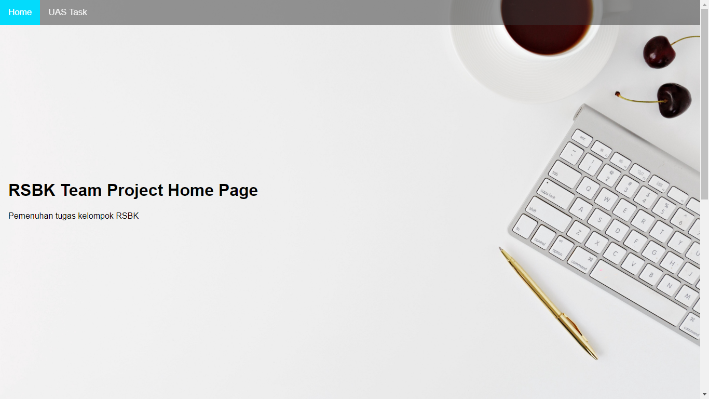
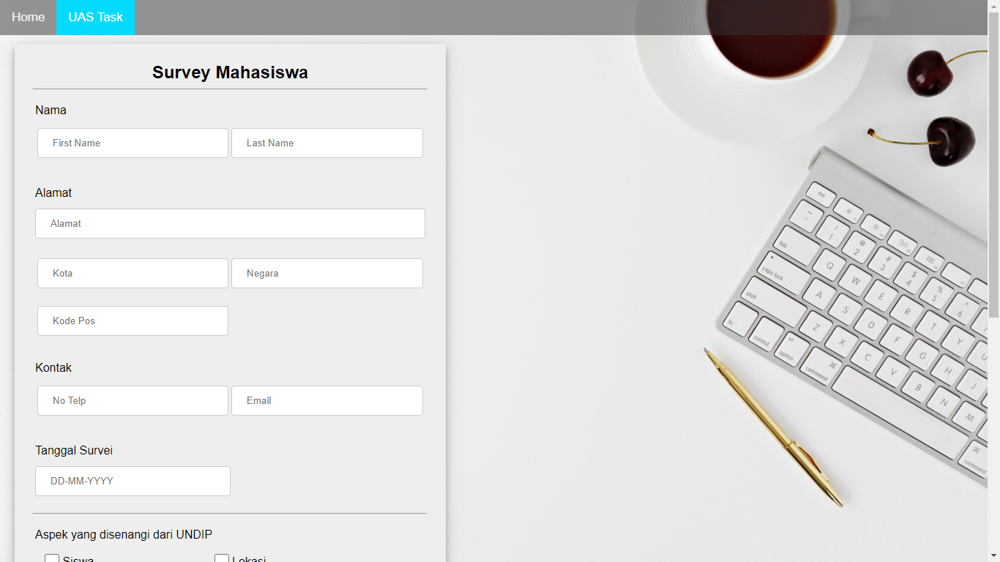
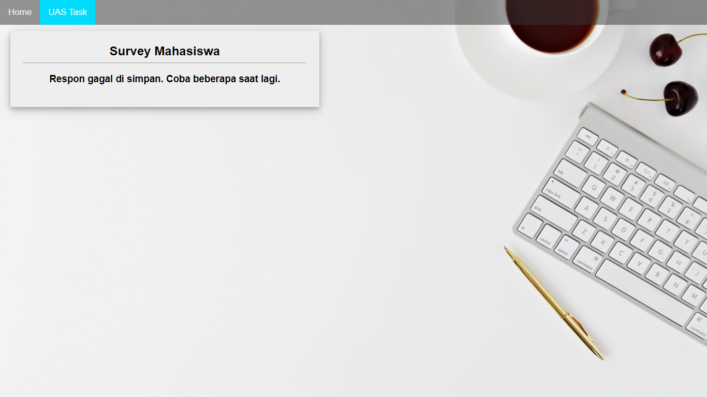
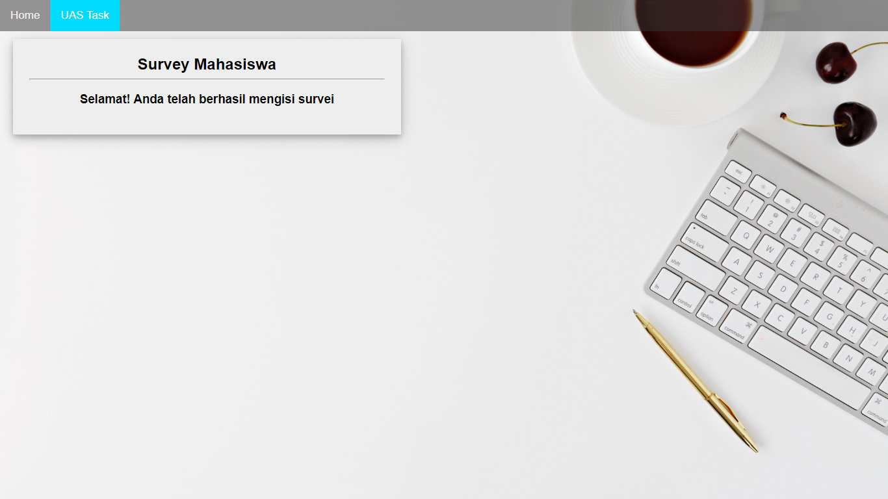

# Tugas JSF RSBK

Tugas UTS, oleh kelompok:
- Muhammad Fachrurrozy | 21120117130073
- Divianis Oktaviyani | 21120117120017
- Dwi Supardiyono | 21120117120024

#Instalasi

Local Server

- Import RSBKproject.war ke dalam Eclipse
- Klik kanan pada project ? Run As > Run on server
- Web browser akan terbuka dengan sendirinya

note: webserver yang telah dicoba: Payara dan Tomcat 8.5

Database yang digunakan: mysql pada 
https://db4free.net/

### URL S3 / HomePage
https://rsbk-rozyzzx.s3.us-east-2.amazonaws.com/

### URL EC2 instance
http://rsbkuas-env.eba-zs6hspem.us-east-2.elasticbeanstalk.com/

# Screenshots

